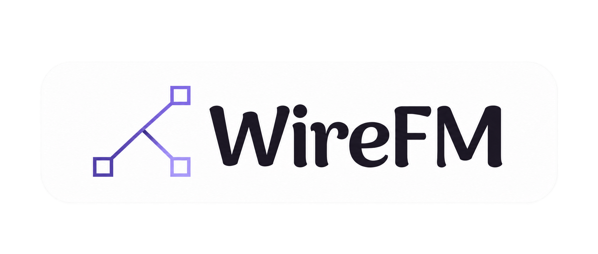
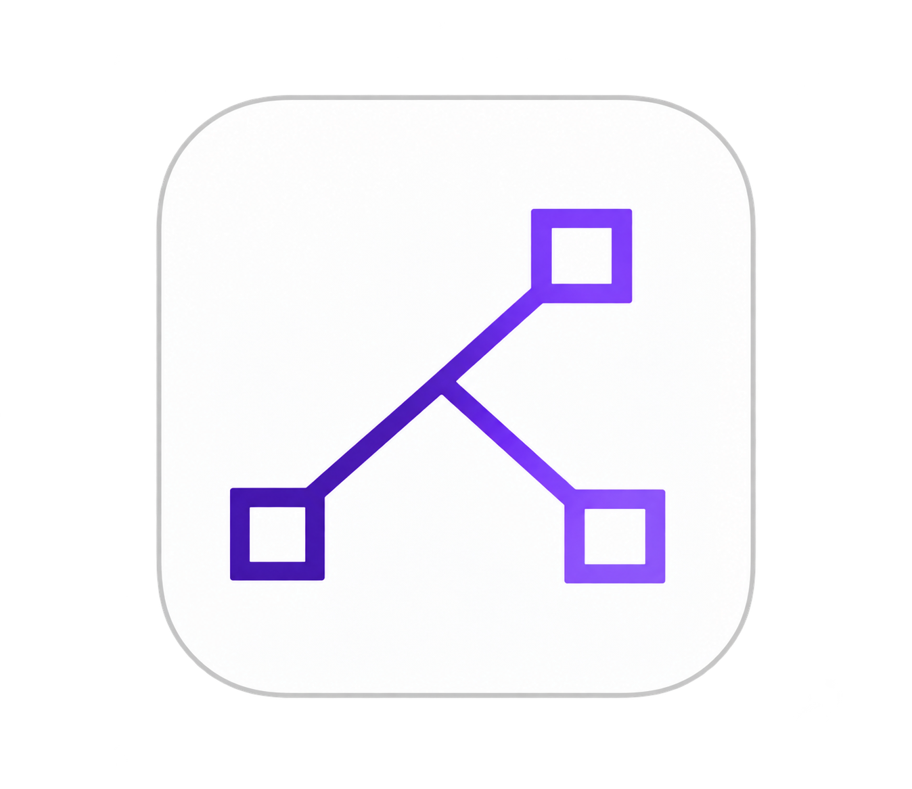

<p align="center">
  
</p>

<p align="center">
  
</p>

<p align="center">
  <a href="https://github.com/jasmin1727/WireFM/releases/latest/download/WireFM.apk">
    
  </a>
  <a href="#-quick-start-pc">
    
  </a>
</p>

<p align="center">
  
  
  
  
</p>

---

## 📥 Direct Downloads

> ### 📱 **[👉 CLICK HERE TO DOWNLOAD ANDROID APK (WireFM.apk)](https://github.com/jasmin1727/WireFM/releases/latest/download/WireFM.apk)**
> *Install directly on your Android phone without needing Android Studio!*

---

## ⚡ Highlights

- 🎯 **Zero Setup**: 1 command to run on PC, 1 tap to scan on Android.
- 📱 **Instant QR Code Pairing**: Terminal generates a QR code — scan with phone camera to connect in 1 second.
- 📂 **Bidirectional File Management**:
  - Browse, copy, move, rename, delete files on PC from phone.
  - Browse, download, and upload files to phone from PC.
- 🐧 **Native Linux Explorer Integration**:
  - Auto-detects **Dolphin**, **Thunar**, or **Nautilus**.
  - Mounts phone as a native network drive using WebDAV.
- 🪶 **Ultra Lightweight**:
  - PC server is a single **~11MB Go binary** with zero dependencies.
  - Web UI is 100% embedded inside the binary.
  - Clean Lavender/Purple theme matching modern desktop and phone aesthetics.

---

## 💻 OS Availability & Support

| Operating System | Status | Details |
| :--- | :---: | :--- |
| 🐧 **Linux** | ✅ **Supported** | Full integration: Dolphin, Thunar, Nautilus, CLI & WebDAV mount. |
| 📱 **Android** | ✅ **Supported** | Native Kotlin app with QR camera auto-pairing. |
| 🍎 **macOS** | 🚧 *In Progress* | Native Finder WebDAV volume connection coming soon. |
| 🪟 **Windows** | 🚧 *In Progress* | Windows Explorer Map Network Drive auto-script coming soon. |

---

## 🚀 Quick Start (PC)

### 1-Line Install (Arch / Ubuntu / Debian / Fedora):
```bash
curl -sSL https://raw.githubusercontent.com/jasmin1727/WireFM/main/install.sh | bash
```

### Run WireFM:
```bash
wirefm
```
*(Or specify a custom directory to share: `wirefm /path/to/folder`)*

Terminal will show:
1. Local IP & WebDAV endpoints.
2. An ASCII QR Code.
3. Open the link in any browser or scan with the **WireFM Android App**.
---
## 📱 WireFM Mobile App (Android)
<table>
  <tr>
    <td align="center" valign="middle">
      
    </td>
  </tr>
  <tr>
    <td align="center">
      <a href="https://github.com/jasmin1727/WireFM/releases/latest/download/WireFM.apk">
        <b>⬇️ Download</b>
      </a>
    </td>
  </tr>
</table>
1. Download [`WireFM.apk`](https://github.com/jasmin1727/WireFM/releases/latest/download/WireFM.apk) onto your phone and install.
2. Open the app and tap **"Connect Your Pc (Scan QR)"**.
3. Point your camera at the PC terminal's QR code.
4. 🎉 **Done!** You now have complete access to manage all files and folders.

---

## 🐧 Native Dolphin / Thunar Auto-Mount

Want to open your phone inside your favorite Linux File Manager?
```bash
./mount_phone.sh <PHONE_IP>
```
This mounts via `gio` / `kio-fuse` directly into Dolphin or Thunar sidebar!

---

## 🛠️ Architecture & Tech Stack

```
           ┌──────────────────────┐
           │      WireFM (Go)     │
           │  • Port 8080 (REST)  │
           │  • Port 8081 (WebDAV)│
           │  • Terminal QR Code  │
           └──────────┬───────────┘
                      │ Local Wi-Fi (HTTP / WebDAV)
                      ▼
           ┌──────────────────────┐
           │   WireFM (Kotlin)    │
           │  • ZXing QR Scanner  │
           │  • Bi-directional FM │
           │  • Material Purple UI│
           └──────────────────────┘
```

---

## 📋 Roadmap & TODO

### ✅ Completed
- [x] **Lightweight Standalone Server**: Single ~11MB Go binary with zero external dependencies.
- [x] **Terminal QR Code**: Auto-generates ASCII QR code for zero-friction mobile pairing.
- [x] **Embedded Modern Web UI**: Fast, responsive Dark & Lavender Web File Manager.
- [x] **Full File Operations API**: Browse, download, upload, delete, rename, copy, and move.
- [x] **WebDAV Server**: Built-in WebDAV on port `8081` for native file explorer mounting.
- [x] **Linux Desktop Detection**: Automatic detection and mounting for Dolphin, Thunar, and Nautilus.
- [x] **Native Android Architecture**: Kotlin app with built-in ZXing QR scanning.
- [x] **One-Line Install Script**: `curl -sSL ... | bash` installer.
- [x] **Automated CI/CD**: GitHub Actions workflow for building Android APK and Linux binaries.

### 🚧 Coming Soon (In Active Development)
- [ ] **Mobile UI Perfection**: Polished animations, fluid transitions, and refined touch ergonomics.
- [ ] **Cross-Platform Native Mounting**: 1-click mounting scripts for macOS Finder and Windows Explorer.
- [ ] **Media Viewer**: In-browser and in-app image preview gallery, audio playback, and video streaming.
- [ ] **Batch Drag-and-Drop**: Multi-file and whole folder drag-and-drop uploading.
- [ ] **Encrypted Wi-Fi Transfers**: Optional TLS/HTTPS mode with PIN verification for untrusted networks.
- [ ] **Performance Optimizations & Bug Fixes**: Continuous memory and throughput improvements.

---

## 🤝 Contributing

Contributions are what make the open-source community such an amazing place to learn, inspire, and create. Any contributions you make to **WireFM** are **greatly appreciated**!

We welcome all developers, designers, and enthusiasts to help:
- ⚡ Make file operations even faster and lighter.
- 🎨 Refine and perfect the UI/UX across web and mobile.
- 🐛 Squashing bugs and improving edge-case stability.
- 🌐 Expanding platform support for macOS and Windows.

**How to contribute:**
1. Fork the Project
2. Create your Feature Branch (`git checkout -b feature/AmazingFeature`)
3. Commit your Changes (`git commit -m 'feat: Add some AmazingFeature'`)
4. Push to the Branch (`git push origin feature/AmazingFeature`)
5. Open a Pull Request

---

## 💬 Feedback, Support & Contact

> **⭐ Loving WireFM?**
> If WireFM makes your day-to-day workflow smoother, please consider giving it a ⭐ **Star** on [GitHub](https://github.com/jasmin1727/WireFM)! Thank you for using and supporting this project.

> **🐛 Found a Bug or Issue?**
> If you run into any bugs, unexpected behavior, or difficulties, we are truly sorry for the inconvenience! Please let us know so we can fix it immediately:
> - 📝 Open a [GitHub Issue](https://github.com/jasmin1727/WireFM/issues)
> - 📧 Or email directly at: **[thakorjasmin503@gmail.com](mailto:thakorjasmin503@gmail.com)**

---

## 📄 License

Distributed under the **MIT License**. See [`LICENSE`](LICENSE) for more information.

Copyright © 2026 **[Jasmin Thakor](https://github.com/jasmin1727)**
